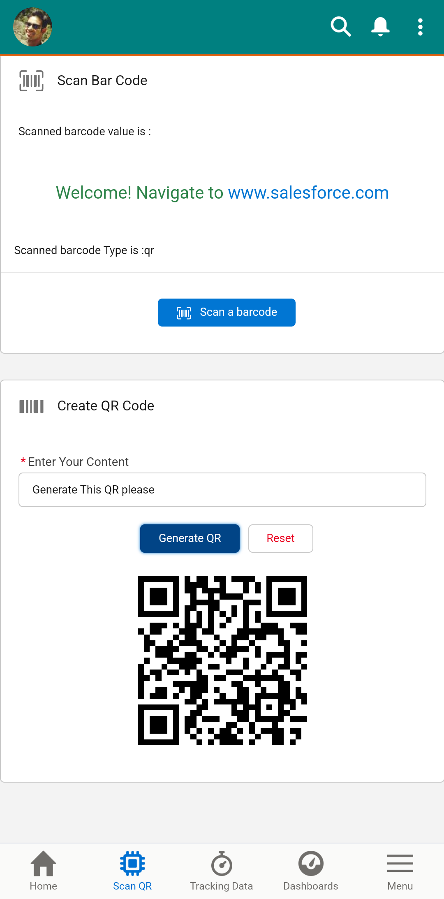
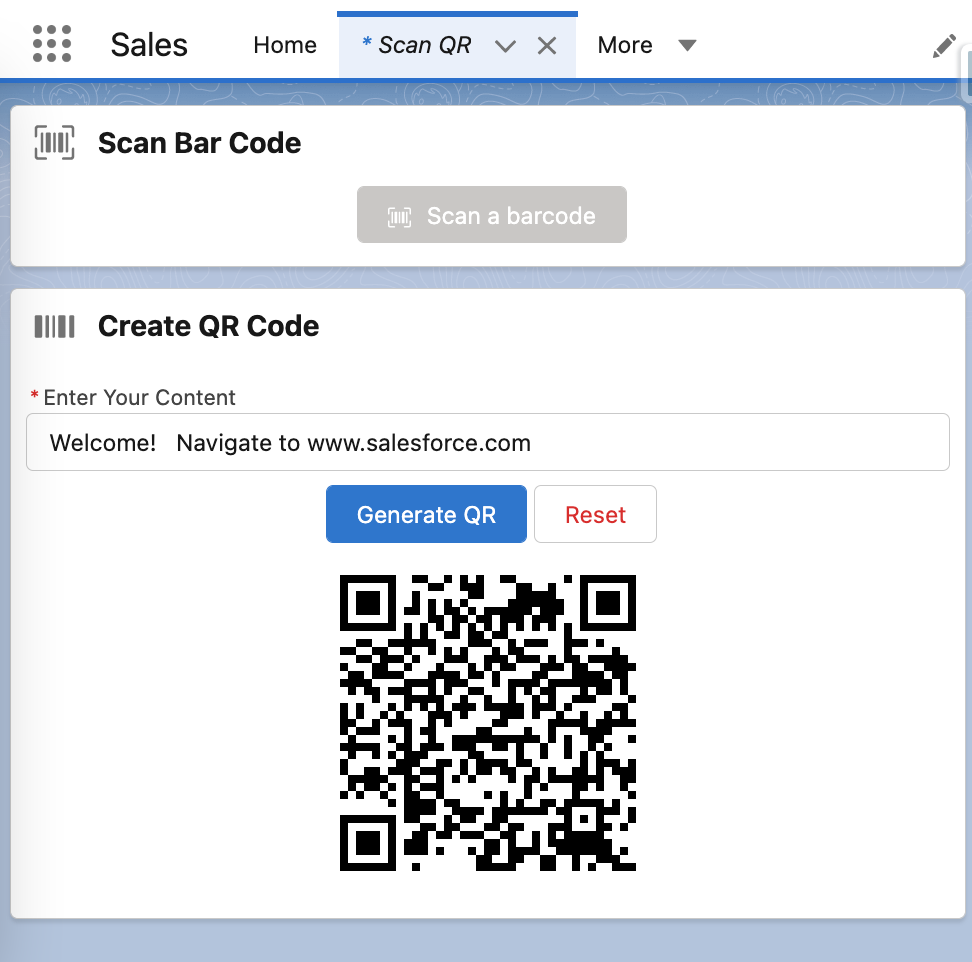
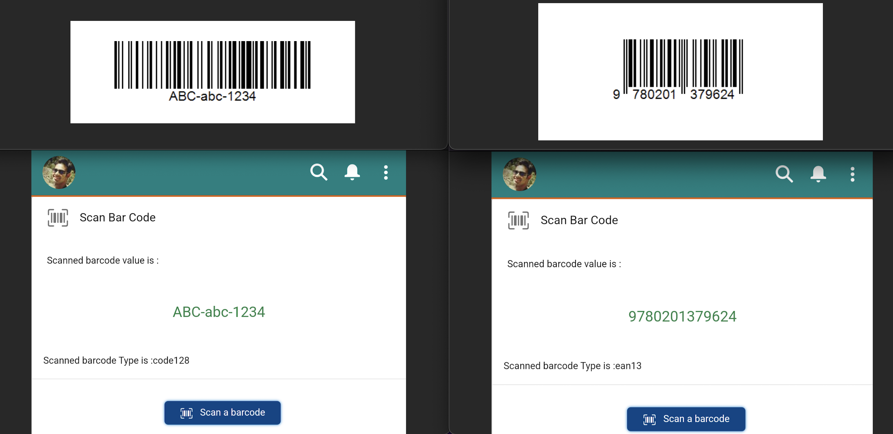

# lwc-barcode
Salesforce LWC to Scan barcodes using mobile camera (Only Mobile Salesforce App) as well as to Create a QR Code for any content. (Desktop &amp; Mobile)

---
### Highlights

Salesforce had released a new [BarcodeScanner API](https://developer.salesforce.com/docs/component-library/documentation/en/lwc/lwc.reference_lightning_barcodescanner) which supports barcode scanning natively on LWC for mobile devices using the Salesforce Mobile App.
Since it’s supported natively, we don’t need to worry about maintaining 3rd party Javascript, Locker services, performance issues, etc.

This Salesforce LWC Component contains methods to Scan any of the [Supported Bar Codes by Salesforce](https://developer.salesforce.com/docs/component-library/documentation/en/lwc/lwc.reference_lightning_barcodescanner_constants) and also provides an ability via JavaScript file to Create a QR Code out of user-entered string content.
QR Code Generation can be done on Desktop or Mobile experience whereas the Bar Code scanning works in *Salesforce Mobile App only.*

For Scanning Bar Codes, steps involved are-
- import lightning/mobileCapabilities
- initiate scanner variable using method getBarcodeScanner()
- set configuration suggesting which barcodes are supported
- use begineCapture() method top launch mobile camera
- read the result or handle error

---

### App Example Screenshots

Mobile View = 

Desktop View =

Scanned Examples on Mobile = 

---

### Author

* **Waseem Ali Sabeel** - [@WaseemAliSabeel](https://github.com/WaseemAliSabeel) :cowboy_hat_face:

---

### Support

Reach out at one of the following places!

- Website at [sfwiseguys.wordpress.com](https://sfwiseguys.wordpress.com) :tophat:
- Twitter at [@sfwiseguys](https://twitter.com/sfwiseguys)
---
